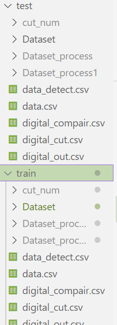

# 电表数字识别代码设计

数据文件:



其中data.csv ,Dataset 为对应原始数据与图片

## 一.对图像进行预处理

预处理设计思路
核心流程围绕去反光→畸变矫正→对比度增强展开，通过标准化处理提升模型鲁棒性。
1. 去反光（伽马校正）,利用伽马校正（gamma<1）压缩高亮区域，增强暗部对比度。
2. 畸变矫正,通过cv2.remap生成无畸变映射关系。可调参数k1/k2控制径向畸变强度，适配不同拍摄设备。
3. 对比度增强（CLAHE）

## 二.目标检测


### **目标检测设计思路**  
此部分根据已有训练集dataset以及data.csv 目标是生成data_detect.csv 也就是经过处理识别出的数字表盘区域,为之后的数字识别做铺垫

### **1. 模型选择：YOLOv8轻量级方案**  
- **速度与精度平衡**：YOLOv8n作为轻量级模型，在边缘设备上可实现实时推理（30+ FPS），满足工业场景部署需求。  
- **泛化能力**：基于COCO预训练的权重可快速迁移至电表检测任务，减少小样本训练过拟合风险。  
- **生态支持**：Ultralytics官方库提供便捷的训练、推理接口，支持自定义数据集。  

### **2. 数据集构建：标注与增强**  
#### **数据标注**   
**标注工具**：使用LabelMe或Roboflow标注
  每个标注文件包含边界框坐标（XYXY格式）和类别标签（0表示电表区域）。  
### **3. 后处理优化：过滤与校准**  
#### **非极大值抑制（NMS）**  
- 通过`iou_threshold=0.5`过滤重叠框，确保每个电表区域仅保留最优检测框。  
#### **几何约束**  
- **宽高比校验**：假设电表读数区域为矩形（宽高比约为3:1），过滤异常比例的检测框。  
- **尺寸过滤**：排除面积过小的框（如小于100x50像素），避免误检干扰区域.

## 三.数字识别


以下是针对电表数字识别任务的代码设计思路,通过目标检测得到的data_detect.csv 来对数字进行分割,然后分别检测,最后拼接为数字进行组装并保存到 digital_out.csv中 

### **1. 架构设计思路**
#### **1. 基础模型选择：AlexNet的优势**
- **结构轻量**：相比VGG/ResNet，AlexNet层数较少，计算量更小。  
- **预训练权重**：使用ImageNet预训练权重初始化，加速收敛并提升小样本性能。  
- **适配尺寸**：原始输入尺寸为224x224，兼容电表数字图像的常见分辨率。  

#### **2. 改进策略：残差连接 + 注意力机制**
##### **残差连接（Residual Block）**
- **作用**：解决深层网络训练困难问题，允许梯度直接通过 shortcut 连接反向传播。  
- **实现**：在特征提取层的每组卷积后添加残差块，确保输入与输出通道数一致（如192→192、384→384）。  

##### **通道注意力机制（SE Module）**
- **作用**：通过学习通道间的依赖关系，增强关键特征通道（如区分6/9的曲线特征）。  
- **实现**：在残差块后添加SE模块，对每个通道的特征进行加权。  
- **代码逻辑**：  
#### **3. 分类器优化**
- **轻量化设计**：将原始AlexNet的三层全连接（4096→4096→10）改为两层（2048→10），减少参数约50%。  
- **正则化**：添加Dropout（rate=0.5）和BatchNorm，抑制过拟合并加速收敛。  

### **4.设计思路流程图**
```
输入图像 (224x224)
│
├── 特征提取层 (AlexNet基础结构 + 残差块 + SE模块)
│   ├── 第1组卷积：3→64通道，提取基础特征（边缘、纹理）
│   ├── 第2组卷积：64→192通道，添加残差块和SE模块增强特征
│   ├── 第3组卷积：192→384通道，进一步提取语义特征
│   ├── 第4组卷积：384→256通道，适配小尺寸特征图
│   └── 第5组池化：输出256×6×6特征图
│
├── 分类器 (轻量化全连接层)
│   ├── 展平特征图：256×6×6 → 9216维向量
│   ├── 降维全连接：9216→2048，减少参数
│   └── 输出层：2048→10，预测数字类别
│
└── 输出预测结果 (0-9数字)
```